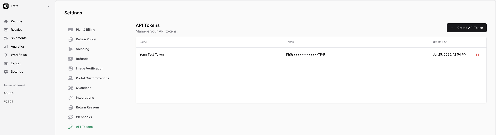

---
title: 'Basic Usage'
description: ''
--- 

## Who is this for?
You **work with returns data** for a Shopify brand. You are most likely a developer that works directly for a brand, or at a B2B company which works with brands (3PL, WMS, CX automation, etc.)

## Preview

Look how easy it is to query returns data for a client:

<CodeGroup>

```cURL cURL
curl -X GET "https://api.fratereturns.com/api/v2/return-groups" \
  -H "X-Frate-Api-Token: YOUR_API_TOKEN"
```

```python Python
import requests

url = "https://api.fratereturns.com/api/v2/return-groups"
headers = {
    "X-Frate-Api-Token": "YOUR_API_TOKEN"
}

response = requests.get(url, headers=headers)
print(response.status_code)
print(response.json())
```

```javascript JavaScript
const url = "https://api.fratereturns.com/api/v2/return-groups";
const headers = {
    "X-Frate-Api-Token": "YOUR_API_TOKEN"
};

fetch(url, {
    method: "GET",
    headers: headers
})
.then(response => response.json())
.then(data => console.log(data))
.catch(error => console.error("Error:", error));
```

</CodeGroup>

And I get a response like:

```json
[
  {
    "type": "return_group",
    "id": 929725,
    "return_method": "TRADITIONAL",
    "credit_method": "STORE_CREDIT",
    "created_at": "2025-07-02T16:30:09.429280+00:00",
    "updated_at": "2025-07-02T16:39:00.560311+00:00",
    "order": {...},
    "customer": {...},
    "shipments": [...],
    "returns": [...],
    "exchange_line_items": [...],
    "refund_transactions": [...],
    "suggested_refund": {...}
  }
]
```

<Expandable title="full response">

```json
[
  {
    "type": "return_group",
    "id": 929725,
    "return_method": "TRADITIONAL",
    "credit_method": "STORE_CREDIT",
    "created_at": "2025-07-02T16:30:09.429280+00:00",
    "updated_at": "2025-07-02T16:39:00.560311+00:00",
    "order": {
      "type": "order",
      "id": 968571,
      "platform_id": "5465107791929",
      "name": "#3304",
      "created_at": "2025-07-02T15:57:58+00:00",
      "source_name": "shopify_draft_order",
      "fulfilled_at": "2025-07-02T15:58:02+00:00",
      "taxes_included": false
    },
    "customer": {
      "type": "customer",
      "name": "Bailey Newton",
      "email": "returns@frate.co"
    },
    "shipments": [
      {
        "type": "shipment",
        "id": 965048,
        "status": "CREATED",
        "carrier": "USPS",
        "tracking_number": "9434636208303308553443",
        "created_at": "2025-07-02T16:38:12.915827+00:00"
      },
      {
        "type": "shipment",
        "id": 965048,
        "status": "CREATED",
        "carrier": "USPS",
        "tracking_number": "9434636208303308553443",
        "created_at": "2025-07-02T16:38:12.915827+00:00"
      }
    ],
    "returns": [
      {
        "type": "return",
        "id": 893121,
        "platform_id": "gid://shopify/Return/10583441465",
        "created_at": "2025-07-02T16:30:09.429280+00:00",
        "status": "COMPLETED",
        "shipment_id": 965048,
        "product_platform_id": "gid://shopify/Product/7258263683129",
        "product_name": "Thousand Fell x Frank and Oak Sneaker",
        "variant_platform_id": "gid://shopify/ProductVariant/42448499769401",
        "variant_name": "8 / White",
        "sku": "2143967823419770",
        "quantity": 1,
        "return_reason": "SIZE_TOO_LARGE",
        "return_note": "",
        "subtotal": {
          "shop_money": {
            "amount": 149.0,
            "currency_code": "CAD"
          },
          "presentment_money": {
            "amount": 149.0,
            "currency_code": "CAD"
          }
        },
        "discounted_subtotal": {
          "shop_money": {
            "amount": 149.0,
            "currency_code": "CAD"
          },
          "presentment_money": {
            "amount": 149.0,
            "currency_code": "CAD"
          }
        },
        "tax_total": {
          "shop_money": {
            "amount": 0.0,
            "currency_code": "CAD"
          },
          "presentment_money": {
            "amount": 0.0,
            "currency_code": "CAD"
          }
        },
        "tax_percentage": 0.0,
        "total": {
          "shop_money": {
            "amount": 149.0,
            "currency_code": "CAD"
          },
          "presentment_money": {
            "amount": 149.0,
            "currency_code": "CAD"
          }
        }
      },
      {
        "type": "return",
        "id": 893122,
        "platform_id": "gid://shopify/Return/10583441465",
        "created_at": "2025-07-02T16:30:09.429280+00:00",
        "status": "COMPLETED",
        "shipment_id": 965048,
        "product_platform_id": "gid://shopify/Product/6997165572153",
        "product_name": "Frate T-Shirt",
        "variant_platform_id": "gid://shopify/ProductVariant/41171585040441",
        "variant_name": "S / Black",
        "sku": "312412341234",
        "quantity": 1,
        "return_reason": "STYLE",
        "return_note": "",
        "subtotal": {
          "shop_money": {
            "amount": 39.99,
            "currency_code": "CAD"
          },
          "presentment_money": {
            "amount": 39.99,
            "currency_code": "CAD"
          }
        },
        "discounted_subtotal": {
          "shop_money": {
            "amount": 39.99,
            "currency_code": "CAD"
          },
          "presentment_money": {
            "amount": 39.99,
            "currency_code": "CAD"
          }
        },
        "tax_total": {
          "shop_money": {
            "amount": 0.0,
            "currency_code": "CAD"
          },
          "presentment_money": {
            "amount": 0.0,
            "currency_code": "CAD"
          }
        },
        "tax_percentage": 0.0,
        "total": {
          "shop_money": {
            "amount": 39.99,
            "currency_code": "CAD"
          },
          "presentment_money": {
            "amount": 39.99,
            "currency_code": "CAD"
          }
        }
      }
    ],
    "exchange_line_items": [
      {
        "type": "exchange_line_item",
        "id": "42448499802169/0",
        "product_platform_id": "gid://shopify/Product/7258263683129",
        "product_name": "Thousand Fell x Frank and Oak Sneaker",
        "variant_platform_id": "gid://shopify/ProductVariant/42448499802169",
        "variant_name": "8 / Off-White",
        "sku": "2143967823419771",
        "quantity": 1,
        "subtotal": {
          "shop_money": {
            "amount": 149.0,
            "currency_code": "CAD"
          },
          "presentment_money": {
            "amount": 149.0,
            "currency_code": "CAD"
          }
        },
        "discounted_subtotal": {
          "shop_money": {
            "amount": 149.0,
            "currency_code": "CAD"
          },
          "presentment_money": {
            "amount": 149.0,
            "currency_code": "CAD"
          }
        },
        "tax_total": {
          "shop_money": {
            "amount": 0.0,
            "currency_code": "CAD"
          },
          "presentment_money": {
            "amount": 0.0,
            "currency_code": "CAD"
          }
        },
        "total": {
          "shop_money": {
            "amount": 149.0,
            "currency_code": "CAD"
          },
          "presentment_money": {
            "amount": 149.0,
            "currency_code": "CAD"
          }
        }
      }
    ],
    "refund_transactions": [
      {
        "type": "refund_transaction",
        "platform_id": null,
        "amount": {
          "shop_money": {
            "amount": 49.99,
            "currency_code": "CAD"
          },
          "presentment_money": {
            "amount": 49.99,
            "currency_code": "CAD"
          }
        },
        "gateway": "frate-store-credit"
      }
    ],
    "suggested_refund": {
      "type": "suggested_refund",
      "refund_total": {
        "shop_money": {
          "amount": 49.99,
          "currency_code": "CAD"
        },
        "presentment_money": {
          "amount": 49.99,
          "currency_code": "CAD"
        }
      },
      "return_total": {
        "shop_money": {
          "amount": 188.99,
          "currency_code": "CAD"
        },
        "presentment_money": {
          "amount": 188.99,
          "currency_code": "CAD"
        }
      },
      "return_tax_total": {
        "shop_money": {
          "amount": 0.0,
          "currency_code": "CAD"
        },
        "presentment_money": {
          "amount": 0.0,
          "currency_code": "CAD"
        }
      },
      "exchange_total": {
        "shop_money": {
          "amount": 149.0,
          "currency_code": "CAD"
        },
        "presentment_money": {
          "amount": 149.0,
          "currency_code": "CAD"
        }
      },
      "exchange_tax_total": {
        "shop_money": {
          "amount": 0.0,
          "currency_code": "CAD"
        },
        "presentment_money": {
          "amount": 0.0,
          "currency_code": "CAD"
        }
      }
    }
  }
]
```

</Expandable>

## How to get an API token?

Create an API Token from the Frate app:


Once you create it, it will only be available for a one-time-copy, to make sure to copy it right away to your password manager.

Then, in every request to Frate, use that value for the header `X-Frate-Api-Token`.

## What is the rate limit?

You can make up to 300 requests per minute per API key.

If the limit is exceeded, the API will respond with a `429 Too Many Requests` status. In this case, pause API calls briefly before retrying.

## How to make a paginated request?

There are two types of pagination found in the API.

### Limit/offset

The following endpoints support limit/offset based pagination: [ReturnGroups](../endpoints/return-groups).

```
curl -G "https://api.fratereturns.com/api/v2/return-groups" \
  -H "X-Frate-Api-Token: YOUR_API_TOKEN" \
  --data-urlencode "offset=1" \
  --data-urlencode "limit=1"
```

### Cursor

The following endpoints support cursor based pagination: [AllowlistItems](../endpoints/list-allowlist-items).

```
curl -G "https://api.fratereturns.com/api/v2/allowlist-items" \
  -H "X-Frate-Api-Token: YOUR_API_TOKEN" \
  --data-urlencode "before=1" \
  --data-urlencode "limit=1"
```

## How do I handle errors?

We don't have a great error system at the moment. If you see an error, get in contact with support.
