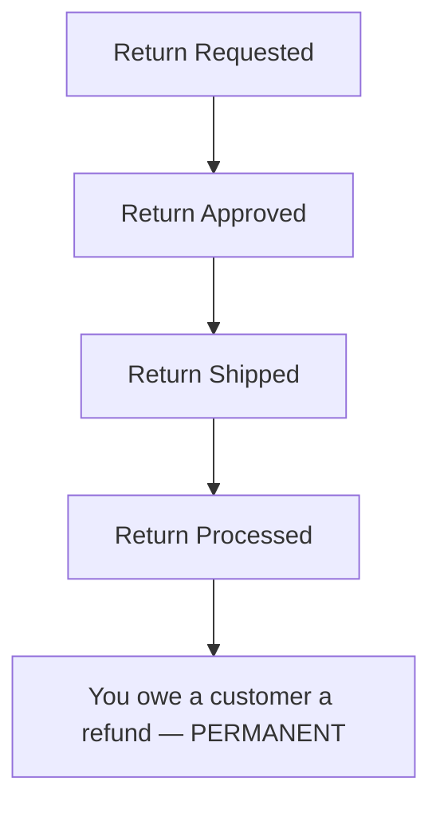
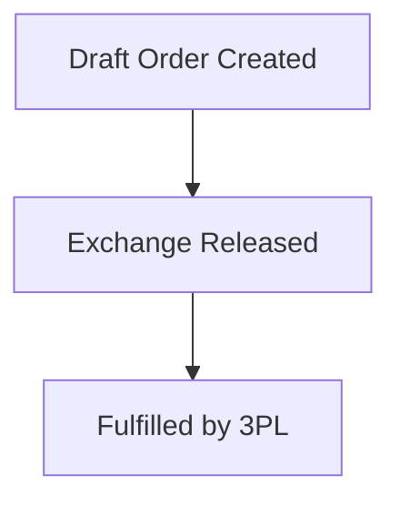

> 10-minute read. For the quick overview, see the [simple version](/guides/return-lifecycle/draft-orders).

## Overview

When your 3PL does **not** support the Shopify Fulfillment Order workflow (e.g., Stord), the Shopify Exchange API cannot be used. Instead, Frate creates exchanges as **separate new orders** via Shopify Draft Orders.

This means the original order and the exchange order are **not linked in Shopify**. The original order never gains a new net sale to offset the return. This creates a permanent financial imbalance on the original order and reporting discrepancies on the exchange order.

This doc walks through every stage of the lifecycle, showing exactly what appears in the Frate dashboard, in the Shopify order admin, and in Shopify Explore analytics. It explains why "You owe a customer a refund" appears, why it's permanent, and how to reconcile your books.

---

## Three Levers That Control Timing

Every state transition in this lifecycle is driven by three settings you configure in Frate:

1. **Refund / Store Credit Trigger** — At what shipment stage (Shipped, Delivered, or Inspected) is the return processed and the refund (or store credit gift card) issued?
2. **Exchange Release Trigger** — At what shipment stage (Shipped, Delivered, or Inspected) is the Draft Order completed into a real order and the new item sent?
3. **Instant Exchange** — An option where the exchange is released immediately upon return approval, before the customer ships back. An authorization hold is placed on the customer's card.

These are configured **independently**. The exchange can be released before or after the return is processed.

---

## Why This Flow Exists

The Shopify Exchange API requires the 3PL to support the Fulfillment Order workflow — a Shopify-native protocol for managing fulfillment requests. Some 3PLs (like Stord) do not support this workflow yet. Without it, Frate cannot add exchange line items to the original order's Return object.

The workaround: Frate creates a Draft Order for the exchange item, applies a 100% discount to zero out the payment (since the customer already paid on the original order), and completes it into a real order when the exchange is released. The exchange order is tagged `frate-exchange` so it can be identified.

This was the industry standard before the Exchange API was released. It works, but it splits the financial picture across two orders.

---

## The Core Concept

With the Exchange API, the exchange adds a new net sale to the original order, which offsets the return. The financials balance on one order.

Without the Exchange API, the exchange creates a separate order. The original order **never gets a new net sale**. When the return is processed, the original sale is canceled, but the payment remains. Shopify sees payment > net sales and says "You owe a customer a refund." This is the exact same mechanic as when a customer chooses store credit via gift card in the Exchange API flow — the difference is that here, it happens on **every exchange**, not just store credit.

---

## Lifecycle Diagram

Two parallel tracks — the original order and the exchange order — move independently:

**Original Order:**

**Exchange Order:**

---

## Shopify Explore Setup

Throughout this doc, analytics snapshots reference a Shopify Explore report configured as:

- **Metrics**: Gross Sales, Net Sales, Returns, Taxes, Discounts, Net Quantity
- **Dimensions**: Order Name, SKU, Order or Return
- **Filter**: Order Name is one of [original order, exchange order]

At early stages only the original order exists, so the filter shows one order. Once the exchange is released, both orders appear.

---

## Stage-by-Stage Breakdown

### Stage 1: Return Requested

| | State |
|---|---|
| **Frate** | `IN_REVIEW` — return request submitted, pending merchant review |
| **Shopify Admin (Original Order)** | No change. |
| **Shopify Admin (Exchange)** | Draft Order initialized in Frate. Not yet on Shopify. |
| **Sales Agreements** | None. |
| **Financial Status** | Paid (unchanged). |

**Shopify Explore:**

| Order | Type | SKU | Gross Sales | Net Sales | Returns | Discounts | Taxes | Net Qty |
|-------|------|-----|------------|-----------|---------|-----------|-------|---------|
| #1001 | Order | Widget-Blue | $100.00 | $100.00 | $0.00 | $0.00 | $13.00 | 1 |

Nothing has changed. The original sale is on the books.

---

### Stage 2: Return Approved / Label Sent

| | State |
|---|---|
| **Frate** | `OPEN` — return approved, shipping label generated and sent to customer |
| **Shopify Admin (Original Order)** | "Return in progress" visible. Shopify Return in `OPEN` status. |
| **Shopify Admin (Exchange)** | Draft Order created on Shopify. Visible in Shopify Admin under Draft Orders. |
| **Sales Agreements** | None. |
| **Financial Status** | Paid (unchanged). |
| **Inventory** | Not reserved for the exchange. |

**Shopify Explore:**

| Order | Type | SKU | Gross Sales | Net Sales | Returns | Discounts | Taxes | Net Qty |
|-------|------|-----|------------|-----------|---------|-----------|-------|---------|
| #1001 | Order | Widget-Blue | $100.00 | $100.00 | $0.00 | $0.00 | $13.00 | 1 |

Unchanged. Draft Orders do not appear in sales analytics.

---

### Stage 3: Return Shipped

| | State |
|---|---|
| **Frate** | Trigger: `SHIPPED` — customer dropped off the package |
| **Shopify Admin (Original Order)** | Return still in progress. Tracking information synced. |
| **Shopify Admin (Exchange)** | Draft Order still in draft state. |
| **Sales Agreements** | None. |
| **Financial Status** | Paid (unchanged). |

**Shopify Explore:**

| Order | Type | SKU | Gross Sales | Net Sales | Returns | Discounts | Taxes | Net Qty |
|-------|------|-----|------------|-----------|---------|-----------|-------|---------|
| #1001 | Order | Widget-Blue | $100.00 | $100.00 | $0.00 | $0.00 | $13.00 | 1 |

Unchanged.

---

### Stage 4: Exchange Released

The Draft Order is completed and becomes a real Shopify Order.

| | State |
|---|---|
| **Frate** | Exchange released — Draft Order completed |
| **Shopify Admin (Original Order)** | Unchanged — return still in progress. No new line items added. |
| **Shopify Admin (Exchange Order)** | A new order now exists. Tagged `frate-exchange`. A 100% discount (`FRATE_RETURN_CREDIT`) is applied, zeroing out the payment. The exchange item is ready for fulfillment. |
| **Sales Agreements** | None on the original order. The exchange order has its own standard order financials. |
| **Financial Status (Original)** | Paid (unchanged). |
| **Financial Status (Exchange)** | Paid ($0 — fully discounted). |

**Shopify Explore (now filtered for both orders):**

| Order | Type | SKU | Gross Sales | Net Sales | Returns | Discounts | Taxes | Net Qty |
|-------|------|-----|------------|-----------|---------|-----------|-------|---------|
| #1001 | Order | Widget-Blue | $100.00 | $100.00 | $0.00 | $0.00 | $13.00 | 1 |
| #1002 | Order | Widget-Red | $100.00 | $0.00 | $0.00 | -$100.00 | $0.00 | 1 |

The exchange order shows a gross sale of $100 but a net sale of $0 because of the 100% discount. **This is where reporting diverges**: discounts are over-reported by $100, net sales are under-reported by $100, and tax is under-reported on the exchange order.

---

### Stage 5: Return Processed (Final State)

| | State |
|---|---|
| **Frate** | `COMPLETED` — return processed |
| **Shopify Admin (Original Order)** | Return `CLOSED`. The returned item shows as returned. **"You owe a customer a refund" is now visible — and it is permanent.** |
| **Shopify Admin (Exchange Order)** | Unchanged from Stage 4. May now be fulfilled by 3PL. |
| **Sales Agreements** | Return Sales Agreement created on original order. Original sale canceled. |
| **Financial Status (Original)** | "You owe a customer a refund" — payment ($100) remains, net sales = $0. |
| **Financial Status (Exchange)** | Paid ($0). |

**Shopify Explore:**

| Order | Type | SKU | Gross Sales | Net Sales | Returns | Discounts | Taxes | Net Qty |
|-------|------|-----|------------|-----------|---------|-----------|-------|---------|
| #1001 | Order | Widget-Blue | $100.00 | $100.00 | $0.00 | $0.00 | $13.00 | 1 |
| #1001 | Return | Widget-Blue | $0.00 | $0.00 | -$100.00 | $0.00 | -$13.00 | -1 |
| #1002 | Order | Widget-Red | $100.00 | $0.00 | $0.00 | -$100.00 | $0.00 | 1 |

Original order: sale fully offset by return (net = $0). Exchange order: gross sale present but net = $0 due to discount. **In aggregate the financials balance** (one $100 payment, one $100 gross sale on the exchange), **but each individual order looks incomplete.**

---

## "You Owe a Customer a Refund" — Explained

This message appears on the original order after the return is processed. It is the single most common source of confusion in this flow.

### Why It Appears

When the return is processed, Shopify creates a Return Sales Agreement that cancels the original sale. The original payment ($100) remains on the order, but net sales are now $0. Shopify sees that payment exceeds net sales and expects a refund transaction to balance the difference.

No refund is issued on this order because the compensation was given via the separate exchange order. Shopify has no way to link the two orders.

This is the exact same mechanic as when a customer chooses store credit via gift card — the gift card isn't recognized as a refund either.

### It Is Permanent

No action will resolve this message on the original order. The compensation lives on a different order. **This is expected behavior.**

### It Is Not a Real Liability

The exchange order (tagged `frate-exchange`) is the compensation. In aggregate across both orders, the financials balance:
- Original order: $100 payment, $0 net sales (return canceled it)
- Exchange order: $0 payment, $100 gross sale (discounted to $0 net, but the item was delivered)

The customer received their exchange item. The merchant retained the original payment. No refund is owed.

### What to Tell Your Finance Team

- Orders with "You owe a customer a refund" that have a corresponding `frate-exchange`-tagged order can be disregarded for refund purposes.
- The offsetting transaction is on the exchange order.
- You can build a Shopify Explore report filtering for the `frate-exchange` tag to see all exchange orders and their values.

---

## Analytics / Reporting Impact and Workarounds

### The Problem

| Metric | Impact | Reason |
|--------|--------|--------|
| Discounts | Over-reported | Exchange order uses `FRATE_RETURN_CREDIT` 100% discount |
| Net Sales | Under-reported | Exchange order net sales = $0 due to discount |
| Taxes | Under-reported | No tax on a $0 net sale |
| Gross Sales | Accurate | Exchange order records the full gross value |
| Returns | Accurate | Return is recorded correctly on the original order |

### Workarounds

**Isolate exchange orders:** In Shopify Explore, add a filter for Order Tag = `frate-exchange`. This shows all exchange orders. Treat the **gross sale** on these orders as the true net sale for those SKUs.

**Exclude the discount code from reporting:** When analyzing discount performance, exclude the `FRATE_RETURN_CREDIT` discount code. This discount is not a real promotion — it's a mechanism to zero out payment on exchange orders.

**Example Shopify Explore Setup for Exchange Order Reconciliation:**

- **Metrics**: Gross Sales, Net Sales, Discounts, Taxes, Net Quantity
- **Dimensions**: Order Name, SKU
- **Filter**: Order Tag = `frate-exchange`

| Order | SKU | Gross Sales | Net Sales | Discounts | Taxes | Net Qty |
|-------|-----|------------|-----------|-----------|-------|---------|
| #1002 | Widget-Red | $100.00 | $0.00 | -$100.00 | $0.00 | 1 |
| #1005 | Widget-Green | $75.00 | $0.00 | -$75.00 | $0.00 | 1 |

Read the **Gross Sales** column as the true revenue retained via exchanges.

---

## Instant Exchange

With Instant Exchange enabled, the Draft Order is completed into a real order immediately upon return approval — before the customer ships back.

**Flow:** Stage 1 → Stage 2 → Stage 4 (exchange released) → Stage 3 (customer ships) → Stage 5 (return processed)

- An **authorization hold** is placed on the customer's card. If the customer does not ship back the return within the ship-back window, the hold is captured.
- "You owe a customer a refund" will appear on the original order as soon as the return is processed, regardless of when the exchange was released.
- The exchange order is created and tagged `frate-exchange` at the moment of release, same as the standard flow.

---

## FAQ

**Is "You owe a customer a refund" a real liability?**
No. The exchange order (tagged `frate-exchange`) is the compensation. No refund needs to be issued on the original order.

**Will "You owe a customer a refund" ever resolve on the original order?**
No. It is permanent. The compensation lives on a separate order that Shopify cannot link to the original.

**How do I reconcile my books?**
Filter for the `frate-exchange` tag to find all exchange orders. Match them against original orders with processed returns. In aggregate, the financials balance.

**Can I see the link between the two orders?**
Not in Shopify Admin. The link is visible in the Frate Returns dashboard (the exchange order is shown on the return detail page) and in Gorgias (if connected).

**When will my 3PL support the Exchange API?**
This depends on your 3PL adopting the Shopify Fulfillment Order workflow. Contact your 3PL to ask about their roadmap. Once they support it, Frate can switch to the Exchange API flow and all of the reporting issues in this doc go away.
