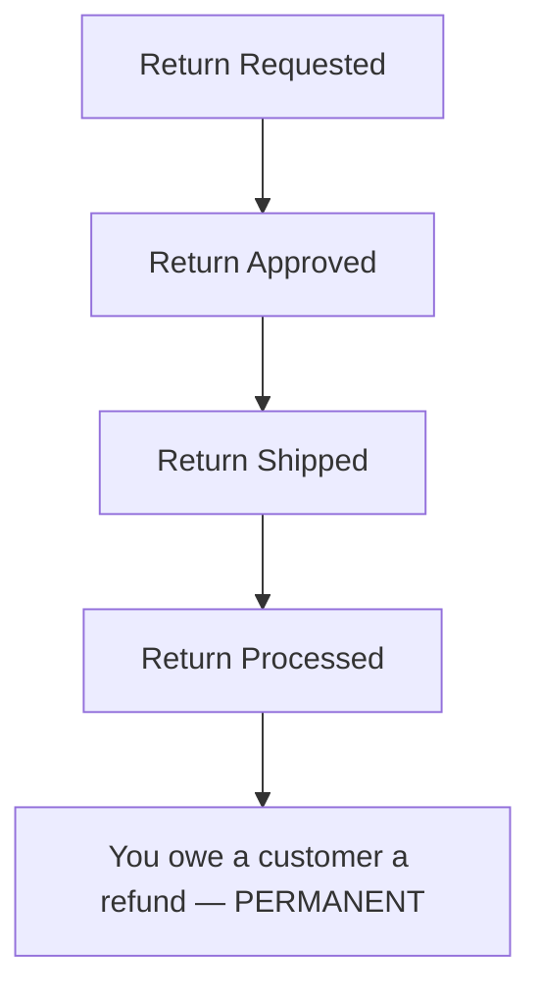
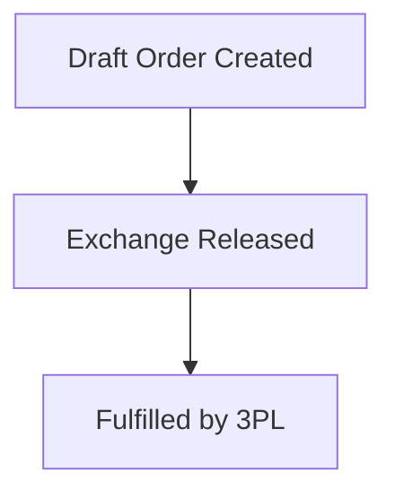

> 2-minute read. For the full stage-by-stage breakdown with Shopify analytics, see the [advanced version](/guides/return-lifecycle/draft-orders-advanced).

## Who Is This For?

You use Frate Returns with a 3PL that does **not** support the Shopify Fulfillment Order workflow (e.g., Stord). Because the Shopify Exchange API requires this workflow, Frate creates exchanges as **separate new orders** using Draft Orders instead of adding exchange line items to the original order.

## Three Levers That Control Timing

1. **Refund / Store Credit Trigger** — At what shipment stage (Shipped, Delivered, or Inspected) is the return processed and the refund issued?
2. **Exchange Release Trigger** — At what shipment stage is the Draft Order completed into a real order and the new item sent?
3. **Instant Exchange** — An option where the exchange is released immediately upon return approval, before the customer ships back.

These are configured independently.

## Lifecycle Overview

Two parallel tracks — the original order and the exchange order — move independently:

**Original Order:**

**Exchange Order:**

**With Instant Exchange**, the Draft Order is completed into a real order immediately upon approval — before the customer ships.

## Key Takeaways

**"You owe a customer a refund" is permanent and expected.** The original order's sale is canceled when the return is processed, but the payment remains. Shopify expects a refund transaction to balance this, but the compensation was given on a separate exchange order. Shopify has no way to link the two. This is the same mechanic as store credit via gift card — it's not a real liability.

**Shopify analytics need filtering.** Exchange orders use a 100% discount code (`FRATE_RETURN_CREDIT`) to zero out payment. This over-reports discounts and under-reports net sales. Filter by the `frate-exchange` order tag to isolate exchange orders and reconcile. Exclude the `FRATE_RETURN_CREDIT` discount code from your discount reporting.

**In aggregate, the financials are correct.** Across the original order (sale canceled by return) and the exchange order (new sale at gross value), the total picture balances. It just doesn't balance within each individual order.
