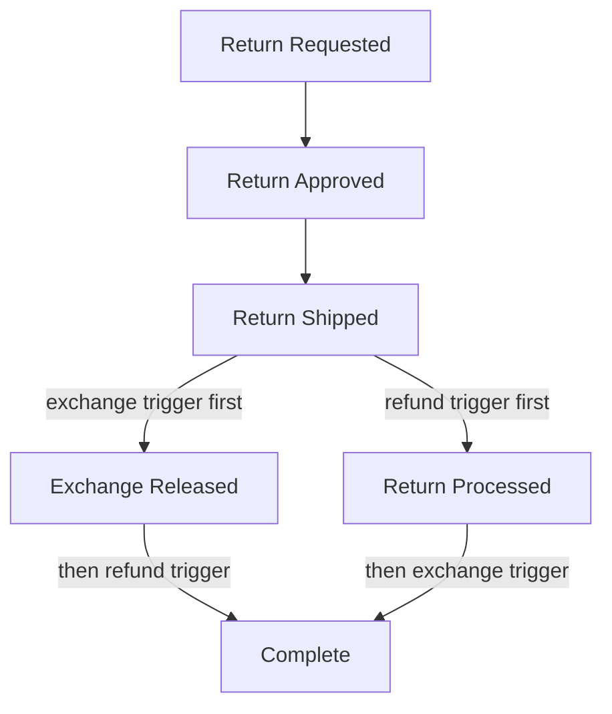

> 10-minute read. For the quick overview, see the [simple version](/guides/return-lifecycle/exchange-api).

## Overview

When your 3PL supports the Shopify Fulfillment Order workflow (e.g., GoBolt, SFN, or self-fulfillment), Frate uses the **Shopify Exchange API** to manage exchanges. This keeps the return and the exchange on the **same Shopify order** — the cleanest possible integration. Return line items and exchange line items are both part of a single Shopify Return object, and Shopify's financial reports stay accurate without any workarounds.

This doc walks through every stage of the lifecycle, showing exactly what appears in the Frate dashboard, in the Shopify order admin, and in Shopify Explore analytics at each step.

---

## Three Levers That Control Timing

Every state transition in this lifecycle is driven by three settings you configure in Frate:

1. **Refund / Store Credit Trigger** — At what shipment stage (Shipped, Delivered, or Inspected) is the return processed and the refund (or store credit gift card) issued?
2. **Exchange Release Trigger** — At what shipment stage (Shipped, Delivered, or Inspected) is the exchange confirmed and the new item sent to the customer?
3. **Instant Exchange** — An option where the exchange is released immediately upon return approval, before the customer even ships back. An authorization hold is placed on the customer's card.

These are configured **independently**. The exchange can be released before or after the return is processed, and this ordering changes what you see on Shopify along the way. Both paths are covered below.

---

## How the Exchange API Works Under the Hood

- When a return with an exchange is approved, Frate calls Shopify's `returnCreate` with both return line items and exchange line items. This records **intent only** — no fulfillment order is created, no Sales Agreement exists, and inventory is not yet reserved for the exchange.
- When the exchange release trigger is reached, Frate calls `returnProcess` on the **exchange line items**. This creates the exchange fulfillment order, creates the Exchange Sales Agreement, and Frate immediately releases the fulfillment hold so the item is ready for the 3PL.
- When the refund trigger is reached, Frate calls `returnProcess` on the **return line items**. This creates the Return Sales Agreement, issues the refund (if applicable), and restocks inventory.
- Inventory is **not** reserved for the exchange until `returnProcess` is called on the exchange line items. This is a known gap.

---

## Lifecycle Diagram

**Path A (exchange first):** "Partially paid" appears at Stage 4a and resolves at Stage 5.
**Path B (return first):** The order is never "Partially paid."
**With Instant Exchange:** Stage 2 → 4a → 3 → 5. Exchange is released before the customer ships.

---

## Shopify Explore Setup

Throughout this doc, analytics snapshots reference a Shopify Explore report configured as:

- **Metrics**: Gross Sales, Net Sales, Returns, Taxes, Discounts, Net Quantity
- **Dimensions**: Order Name, SKU, Order or Return
- **Filter**: Order Name = the order in question

---

## Stage-by-Stage Breakdown

### Stage 1: Return Requested

| | State |
|---|---|
| **Frate** | `IN_REVIEW` — return request submitted, pending merchant review |
| **Shopify Admin** | No change. The order looks exactly as it did before the return. |
| **Sales Agreements** | None. |
| **Financial Status** | Paid (unchanged). |

**Shopify Explore:**

| Order | Type | SKU | Gross Sales | Net Sales | Returns | Discounts | Taxes | Net Qty |
|-------|------|-----|------------|-----------|---------|-----------|-------|---------|
| #1001 | Order | Widget-Blue | $100.00 | $100.00 | $0.00 | $0.00 | $13.00 | 1 |

Nothing has changed. The original sale is on the books.

---

### Stage 2: Return Approved / Label Sent

| | State |
|---|---|
| **Frate** | `OPEN` — return approved, shipping label generated and sent to customer |
| **Shopify Admin** | "Return in progress" visible on the order. The Shopify Return is in `OPEN` status. Exchange line items exist on the Return but are unprocessed. |
| **Sales Agreements** | None. `returnCreate` records intent only — no fulfillment order, no Sales Agreement. |
| **Financial Status** | Paid (unchanged). |
| **Inventory** | Not reserved for the exchange yet. |

If label creation fails, the Shopify Return remains `OPEN` regardless.

**Shopify Explore:**

| Order | Type | SKU | Gross Sales | Net Sales | Returns | Discounts | Taxes | Net Qty |
|-------|------|-----|------------|-----------|---------|-----------|-------|---------|
| #1001 | Order | Widget-Blue | $100.00 | $100.00 | $0.00 | $0.00 | $13.00 | 1 |

Unchanged. Shopify does not put anything on the books until `returnProcess` is called.

---

### Stage 3: Return Shipped

| | State |
|---|---|
| **Frate** | Trigger: `SHIPPED` — customer dropped off the package |
| **Shopify Admin** | Return still in progress. Tracking information synced to the Shopify Return. |
| **Sales Agreements** | None. |
| **Financial Status** | Paid (unchanged). |

**Shopify Explore:**

| Order | Type | SKU | Gross Sales | Net Sales | Returns | Discounts | Taxes | Net Qty |
|-------|------|-----|------------|-----------|---------|-----------|-------|---------|
| #1001 | Order | Widget-Blue | $100.00 | $100.00 | $0.00 | $0.00 | $13.00 | 1 |

Unchanged.

---

### Stage 4a: Exchange Released (Before Return Processed)

This happens when your exchange release trigger is reached before your refund trigger.

| | State |
|---|---|
| **Frate** | Exchange released — `returnProcess` called on exchange line items |
| **Shopify Admin** | Exchange fulfillment order created and immediately released to "Unfulfilled". The exchange item is now visible on the order as a new line item ready for fulfillment. |
| **Sales Agreements** | **Exchange Sales Agreement created.** Shopify records the new sale for the exchange item. |
| **Financial Status** | **"Partially paid"** — Shopify sees net sales on both the original item ($100) AND the exchange item ($100), but only one payment ($100). |

**Shopify Explore:**

| Order | Type | SKU | Gross Sales | Net Sales | Returns | Discounts | Taxes | Net Qty |
|-------|------|-----|------------|-----------|---------|-----------|-------|---------|
| #1001 | Order | Widget-Blue | $100.00 | $100.00 | $0.00 | $0.00 | $13.00 | 1 |
| #1001 | Order | Widget-Red | $100.00 | $100.00 | $0.00 | $0.00 | $13.00 | 1 |

Two items' worth of net sales, one payment. This is temporary — it settles when the return is processed.

---

### Stage 4b: Return Processed (Before Exchange Released)

This happens when your refund trigger is reached before your exchange release trigger.

| | State |
|---|---|
| **Frate** | `COMPLETED` — `returnProcess` called on return line items |
| **Shopify Admin** | Return `CLOSED`. The returned item shows as returned. |
| **Sales Agreements** | **Return Sales Agreement created.** The original sale is canceled. Refund issued if there is a net difference. |
| **Financial Status** | Paid. No "Partially paid" because the exchange hasn't added net sales yet. |

**Shopify Explore:**

| Order | Type | SKU | Gross Sales | Net Sales | Returns | Discounts | Taxes | Net Qty |
|-------|------|-----|------------|-----------|---------|-----------|-------|---------|
| #1001 | Order | Widget-Blue | $100.00 | $100.00 | $0.00 | $0.00 | $13.00 | 1 |
| #1001 | Return | Widget-Blue | $0.00 | $0.00 | -$100.00 | $0.00 | -$13.00 | -1 |

The return row cancels the original sale. Net across both rows: $0.

---

### Stage 5: Both Processed (Final State)

Whichever event happened second completes the picture.

**If exchange was released first (4a → 5):** Return processing cancels the original sale, resolving "Partially paid." Payment now matches the single remaining net sale (the exchange item).

**If return was processed first (4b → 5):** Exchange release adds the new net sale and Sales Agreement. The order was never "Partially paid" at any point.

| | State |
|---|---|
| **Frate** | Return completed, exchange fulfilled |
| **Shopify Admin** | Return closed. Exchange item unfulfilled (or fulfilled, depending on 3PL). |
| **Sales Agreements** | Both Return and Exchange Sales Agreements exist. |
| **Financial Status** | Paid. Financials settled. |

**Shopify Explore:**

| Order | Type | SKU | Gross Sales | Net Sales | Returns | Discounts | Taxes | Net Qty |
|-------|------|-----|------------|-----------|---------|-----------|-------|---------|
| #1001 | Order | Widget-Blue | $100.00 | $100.00 | $0.00 | $0.00 | $13.00 | 1 |
| #1001 | Return | Widget-Blue | $0.00 | $0.00 | -$100.00 | $0.00 | -$13.00 | -1 |
| #1001 | Order | Widget-Red | $100.00 | $100.00 | $0.00 | $0.00 | $13.00 | 1 |

Original sale canceled by return. Exchange item has its own net sale. **Totals balance. All metrics are accurate.**

---

## Store Credit / Gift Card Case

When the customer chooses **store credit** instead of an exchange, the flow is simpler but produces a cosmetic Shopify quirk.

There is no exchange item, so there is no "Exchange Released" stage. The only financial event is "Return Processed":

1. The original net sale is canceled via the Return Sales Agreement.
2. The original payment remains on the order.
3. Shopify sees payment ($100) > net sales ($0) and displays **"You owe a customer a refund."**

**This is cosmetic.** The refund was issued as a Shopify gift card, which creates a liability on your books. Shopify does not recognize gift card issuance as a refund transaction — they are separate concepts in Shopify's data model. The money is accounted for: the gift card is the liability, the return cancels the revenue. They just aren't wired together in the order's financial summary.

**Shopify Explore:**

| Order | Type | SKU | Gross Sales | Net Sales | Returns | Discounts | Taxes | Net Qty |
|-------|------|-----|------------|-----------|---------|-----------|-------|---------|
| #1001 | Order | Widget-Blue | $100.00 | $100.00 | $0.00 | $0.00 | $13.00 | 1 |
| #1001 | Return | Widget-Blue | $0.00 | $0.00 | -$100.00 | $0.00 | -$13.00 | -1 |

The gift card does not appear in order-level analytics. It lives in Shopify's Gift Cards section.

---

## Instant Exchange

With Instant Exchange enabled, the exchange is released immediately upon return approval — before the customer ships back.

**Flow:** Stage 1 → Stage 2 → Stage 4a (exchange released) → Stage 3 (customer ships) → Stage 5 (return processed)

- An **authorization hold** is placed on the customer's card for the exchange value. If the customer does not ship back the return within the ship-back window, the hold is captured.
- **"Partially paid"** will appear on the order from the moment the exchange is released until the return is processed.
- Everything else behaves identically to the standard flow.

---

## Analytics / Reporting Summary

With the Exchange API, Shopify Explore analytics are **accurate at the final state**:

| Metric | Accurate? | Notes |
|--------|-----------|-------|
| Gross Sales | Yes | Original sale + exchange sale both recorded |
| Net Sales | Yes | Original sale canceled by return, exchange sale stands |
| Returns | Yes | Return amount recorded correctly |
| Discounts | Yes | No artificial discount codes used |
| Taxes | Yes | Tax on return reversed, tax on exchange recorded |
| Net Quantity | Yes | -1 for return, +1 for exchange |

Everything lives on a single order. No tags, filters, or workarounds needed.

---

## FAQ

**Why does my order say "Partially paid"?**
The exchange was released before the return was processed. Shopify sees two items' worth of net sales but only one payment. This resolves automatically when the return is processed.

**Why does my order say "You owe a customer a refund"?**
The customer chose store credit (gift card) instead of an exchange. The return canceled the sale but the payment remains. Shopify doesn't recognize the gift card as a refund. This is cosmetic — the gift card is the refund.

**When does inventory move?**
Inventory for the exchange item moves from "Available" to "Committed" when the exchange is released (`returnProcess` on exchange line items). Returned inventory is restocked when the return is processed (`returnProcess` on return line items).

**Is inventory reserved before the exchange is released?**
No. Inventory is not reserved until `returnProcess` is called on the exchange line items. This is a known gap — between return approval and exchange release, the exchange item could theoretically go out of stock.

**Can I configure when the exchange is released vs. when the return is processed?**
Yes. These are independent settings in Frate. You choose the shipment stage (Shipped, Delivered, or Inspected) for each. You can also enable Instant Exchange to release the exchange immediately upon approval.
