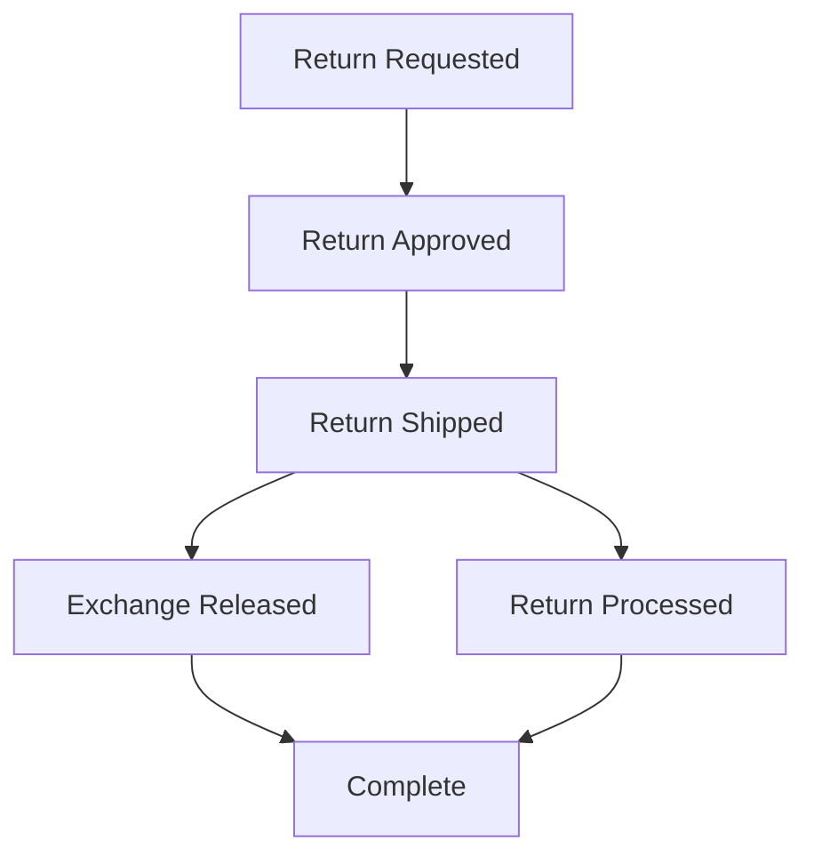

> 2-minute read. For the full stage-by-stage breakdown with Shopify analytics, see the [advanced version](/guides/return-lifecycle/exchange-api-advanced).

## Who Is This For?

You use Frate Returns with a 3PL that supports the Shopify Fulfillment Order workflow (e.g., GoBolt, SFN, or self-fulfillment). Your exchanges use the Shopify Exchange API, which keeps everything on a single order.

## Three Levers That Control Timing

1. **Refund / Store Credit Trigger** — At what shipment stage (Shipped, Delivered, or Inspected) is the return processed and the refund issued?
2. **Exchange Release Trigger** — At what shipment stage is the exchange confirmed and the new item sent?
3. **Instant Exchange** — An option where the exchange is released immediately upon return approval, before the customer ships back. An authorization hold is placed on the customer's card.

These are configured independently — the exchange can be released before or after the return is processed.

## Lifecycle Overview

The two middle stages (4a and 4b) can happen in either order depending on your trigger settings. **With Instant Exchange**, the exchange is released right after approval — before the customer ships. "Partially paid" appears until the return is processed.

## Key Takeaways

**"Partially paid" is temporary and expected.** When the exchange is released before the return is processed, Shopify sees net sales on two items but payment for only one. Once the return is processed, the original sale is canceled and financials settle.

**Store credit via gift card will show "You owe a customer a refund."** When a customer chooses store credit instead of an exchange, no new net sale is added to the order. After the return is processed, the original sale is canceled but payment remains. Shopify doesn't recognize the gift card as a refund transaction — this is cosmetic, not a real liability. The gift card creates the liability separately.

**At the final state, Shopify analytics are accurate.** With the Exchange API, everything lives on one order. No tags, filters, or workarounds needed. Gross sales, net sales, returns, taxes, and discounts all report correctly.
